# mdTool — Technical Diagrams

This document contains all technical charts and diagrams for `mdTool`, a two-layer
tool that renders **Markdown** and **Jupyter notebooks** into themed, self-contained
HTML and faithful PDFs (via headless Chromium print). Diagrams are drawn with
Mermaid so they render directly on GitHub and in the mdTool preview.

- **Layer 1 — Node Core (`src/`)**: framework-agnostic render library + CLI.
- **Layer 2 — Tauri Shell (`tauri-app/`)**: Rust + webview desktop UI that shells out
  to the core.

---

## 1. System Context Diagram

Shows the top-level actors and the two deployable artifacts.

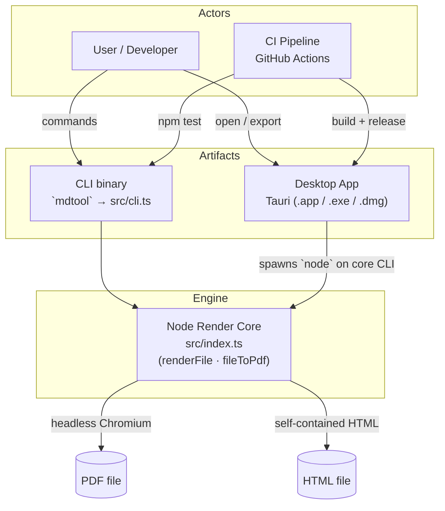

---

## 2. Repository Layout (Component Map)

Directory tree and which layer each part belongs to.

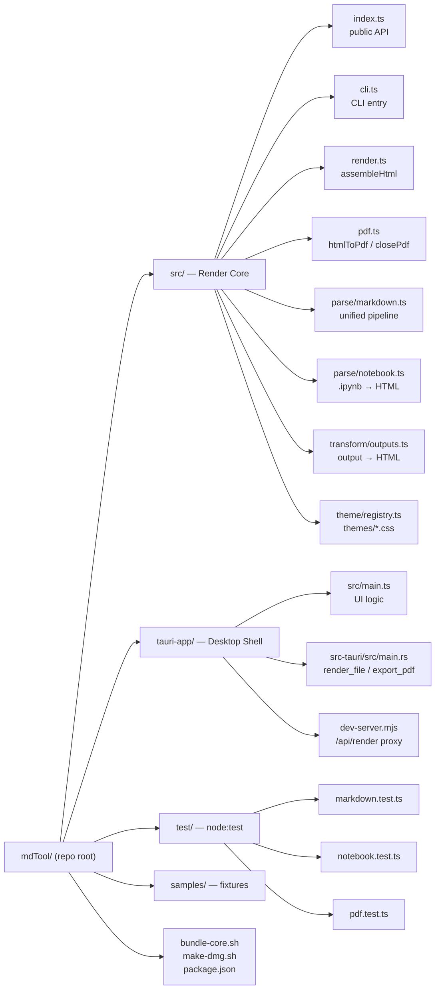

---

## 3. Markdown Render Pipeline

The unified processor in `src/parse/markdown.ts:35-46`. Order is significant.

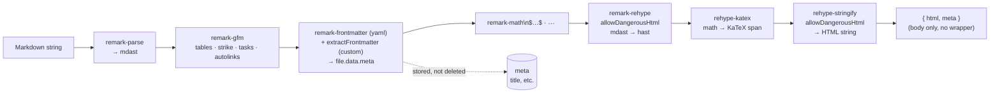

> **Gotcha:** `rehype-raw` / `rehype-sanitize` are declared deps but unused.
> Notebook `text/html` outputs are injected at the string level in `outputs.ts`,
> **not** through this pipeline.

---

## 4. Jupyter Notebook Render Path

Orchestrated by `src/parse/notebook.ts:63-85`; per-cell branching then assembly into
a single `.nb-*`-classed HTML body.

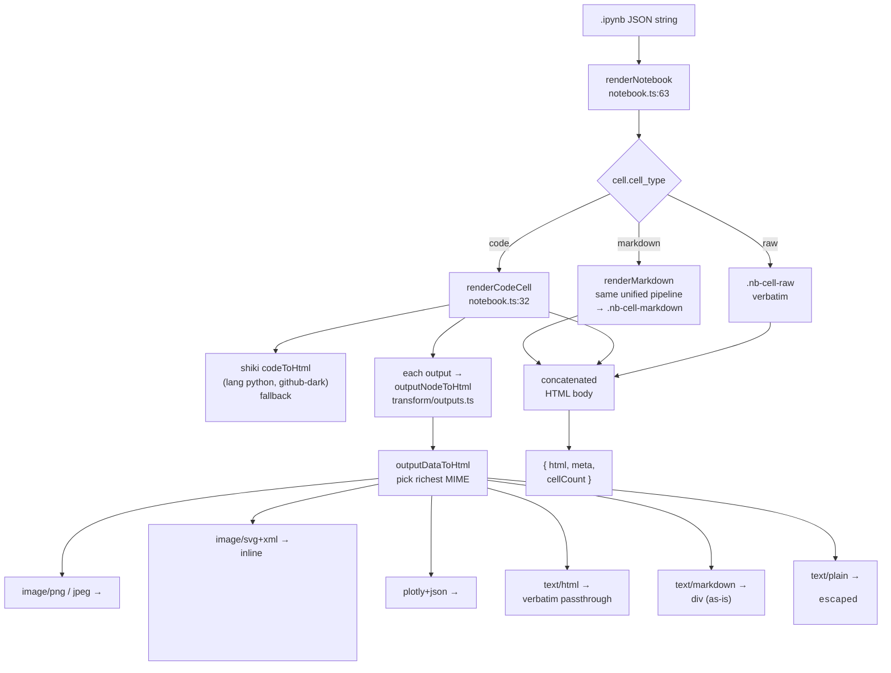

### 4a. Output-to-HTML MIME Preference Order

`outputDataToHtml` (`outputs.ts:21-54`) picks the **richest** available MIME type:

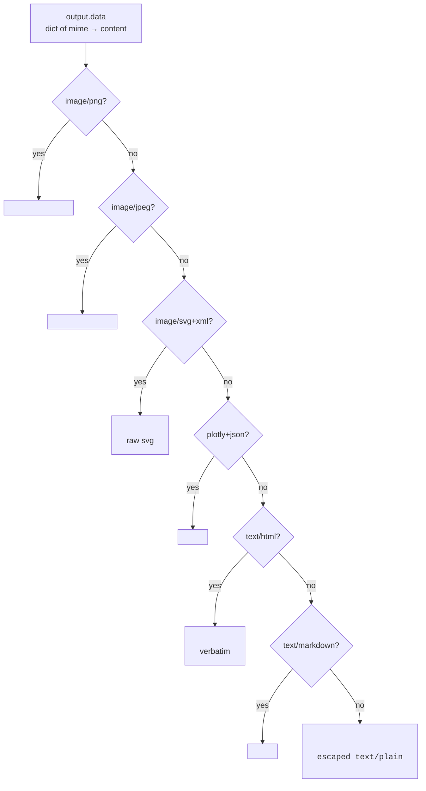

> **Chart fidelity invariant:** `image/png|jpeg` and `svg` become data URIs /
> inlined markup so Chromium print keeps them in exact position. Do **not**
> externalize these.

---

## 5. Theme System & Page Geometry

Two sources of page geometry; one wins depending on how `pdf.ts` is called.

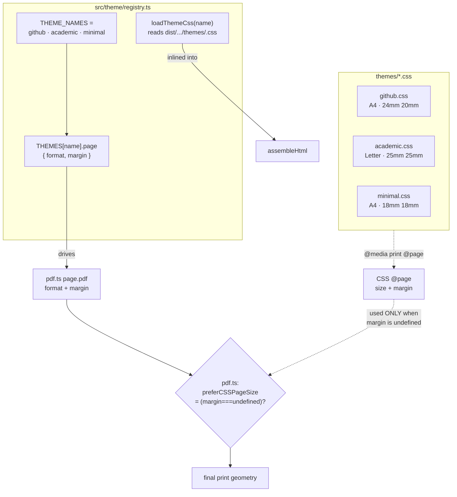

| Theme | `format` | `margin` | CSS `@page` |
|-------|----------|----------|-------------|
| github | A4 | `24mm 20mm` | A4 / 24mm 20mm |
| academic | Letter | `25mm 25mm` | Letter / 25mm 25mm |
| minimal | A4 | `18mm 18mm` | A4 / 18mm 18mm |

> `fileToPdf` always passes `page.margin`, so **registry values win** in normal use;
> CSS `@page` is only honored when no margin is supplied to `htmlToPdf`.

---

## 6. HTML Assembly — `assembleHtml`

`src/render.ts:16-42` produces one fully self-contained, offline document.

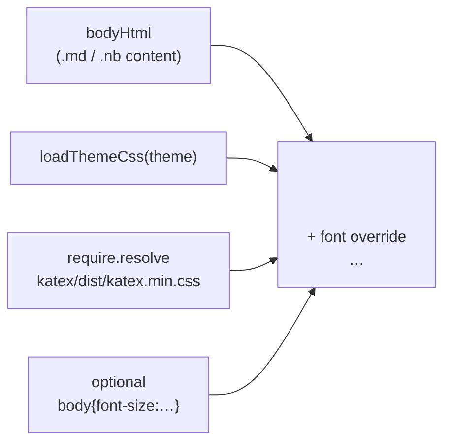

> No network dependency. KaTeX CSS must be inlined (no CDN) so preview and print
> render identically.

---

## 7. PDF Engine — Shared Chromium

`src/pdf.ts` lazily launches one Chromium instance and reuses it.

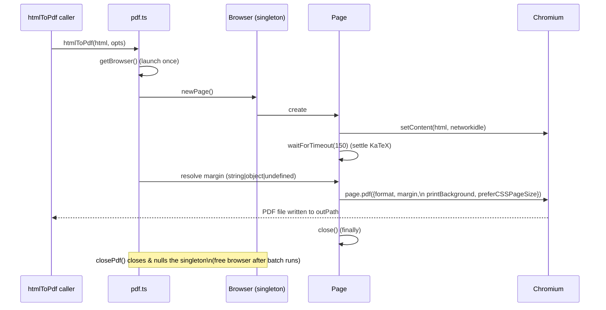

---

## 8. End-to-End Render Flow (single file)

Bridges all core modules — `index.ts` → `render.ts` → `pdf.ts`.

```mermaid
flowchart TB
    F["input file"] --> RF["renderFile\nindex.ts:22"]
    RF --> EXT{extension}
    EXT -->|".ipynb"| NB["renderNotebook"]
    EXT -->|".md/.markdown/…"| MD["renderMarkdown"]
    EXT -->|fallback| MD
    NB --> BODY["{ html, meta }"]
    MD --> BODY
    BODY --> ASM["assembleHtml\n(theme CSS + katex CSS)"]
    ASM --> PG["themePage(theme)\n→ {format, margin}"]
    PG --> TOPDF["htmlToPdf\n(shared Chromium)"]
    TOPDF --> CLOSE["closePdf()"]
    CLOSE --> OUT["PDF on disk"]

    subgraph Defaults
        D1["theme default: github"]
        D2["out default: <input>.pdf"]
    end
```

---

## 9. Tauri Desktop Shell — Control Flow

How the desktop UI reaches the same Node core as the CLI.

```mermaid
flowchart TB
    subgraph UI["tauri-app/src/main.ts (webview)"]
        ISO{"isTauri()?\n__TAURI_INTERNALS__\nin window"}
    end

    ISO -->|yes| INV["invoke('render_file'\n / 'export_pdf')"]
    ISO -->|no (dev browser)| FETCH["fetch('/api/render?path&theme')"]

    INV --> RS["src-tauri/src/main.rs"]
    RS --> CMD["Command::new(node)\n→ core cli.ts / dist/cli.js"]
    CMD --> CORE["Node Render Core\n(--preview → HTML stdout\n --out → PDF file)"]
    CORE --> RET1["render_file: returns HTML"]
    CORE --> RET2["export_pdf: writes PDF"]

    FETCH --> DS["dev-server.mjs\n(port 1420)"]
    DS --> SPAWN["spawn node cli.ts --preview"]
    SPAWN --> CORE
    CORE --> HTML2["HTML → srcdoc"]
```

### 9a. Tauri Core Resolution Logic

`main.rs` decides where `node` and the core entry live.

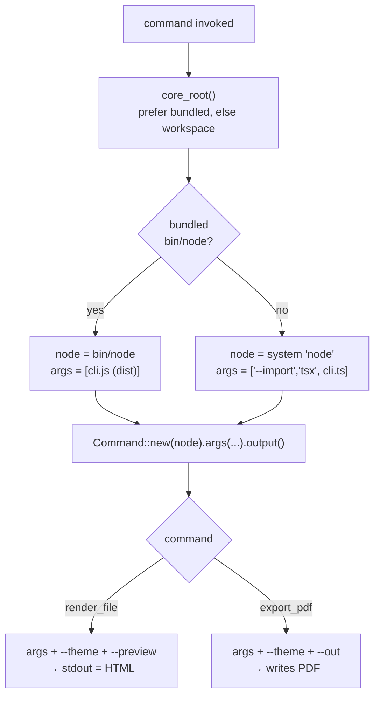

---

## 10. Entry Points & Public API Surface

All ways to drive mdTool.

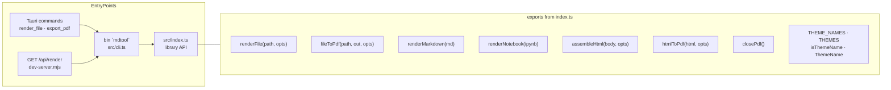

---

## 11. Test Suite Coverage Map

`node --import tsx --test test/*.test.ts`

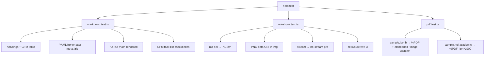

---

## 12. Build & Release Pipeline

How source becomes a shipped app, including the CSS-staging detail.

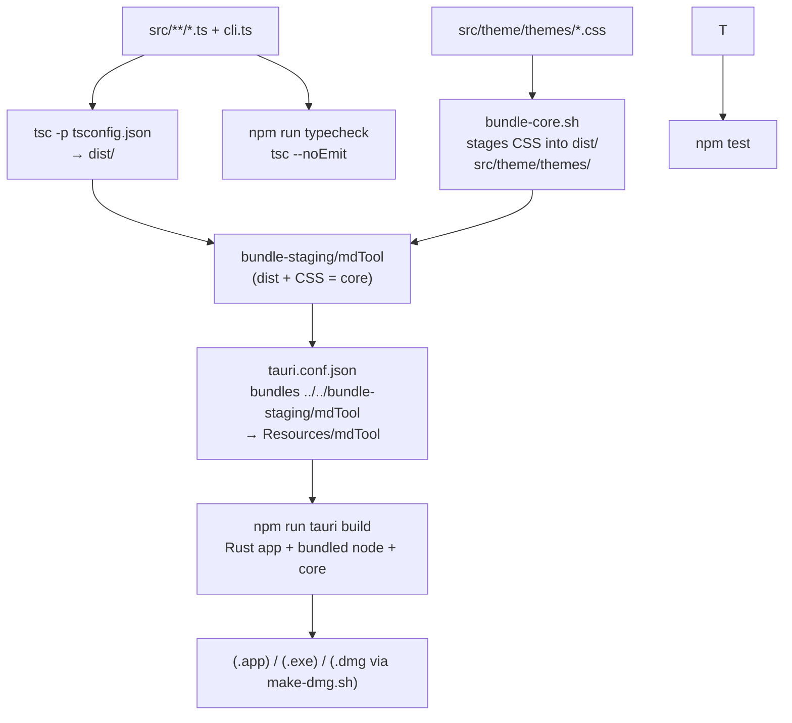

---

## 13. Module Dependency Graph

Internal imports between core modules.

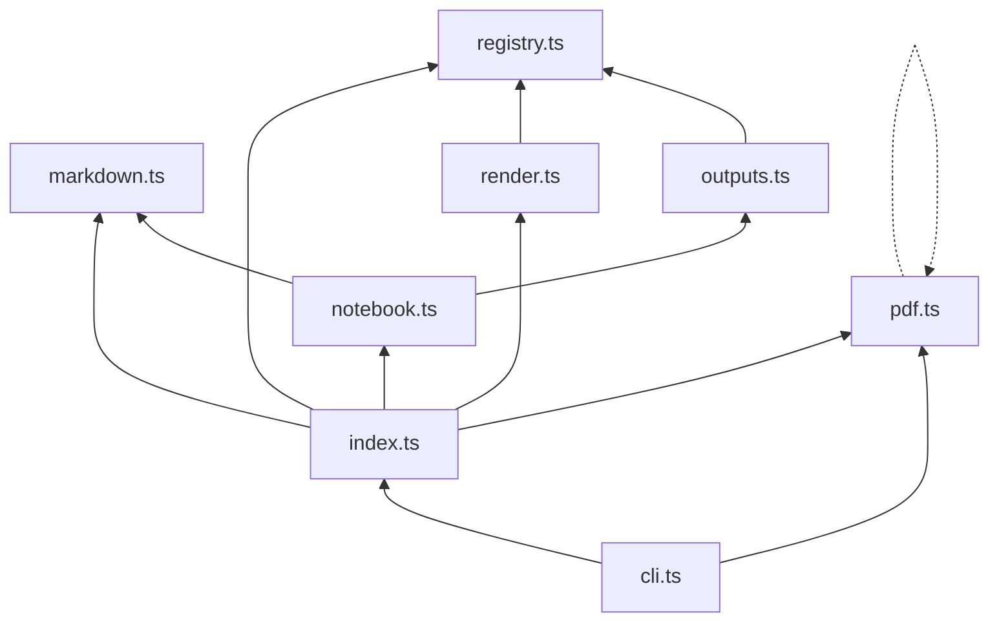

---

## 14. Data Formats & Key Invariants

Quick reference of the contracts each stage obeys.

| Stage | Input | Output | Invariant |
|-------|-------|--------|-----------|
| `renderMarkdown` | Markdown string | `{html, meta}` body-only | frontmatter → `meta` only |
| `renderNotebook` | nbformat v4 JSON | `{html, meta, cellCount}` | per-cell branching |
| `outputDataToHtml` | output `.data` | richest-MIME HTML | data URIs for images/svg |
| `assembleHtml` | body HTML + theme | full `<html>` doc | **offline**, CSS inlined |
| `htmlToPdf` | full HTML | PDF file | shared Chromium, `preferCSSPageSize` |
| `renderFile` | file path | `{html, meta}` | extension dispatch |
| `fileToPdf` | file path + out | PDF path | chains all above |

**Cross-cutting invariants**
1. Input kind dispatched by extension in `renderFile` (`src/index.ts:22`).
2. KaTeX CSS inlined at render time — no CDN, identical print/preview.
3. Charts preserved only as data URIs (`outputs.ts`) — never externalize.
4. One shared Playwright `Browser` (`pdf.ts`); never `chromium.launch()` per doc.
5. CSS files staged by `bundle-core.sh`, **not** compiled by `tsc`.
6. Tauri shell never renders — it only spawns `node` against the core.
